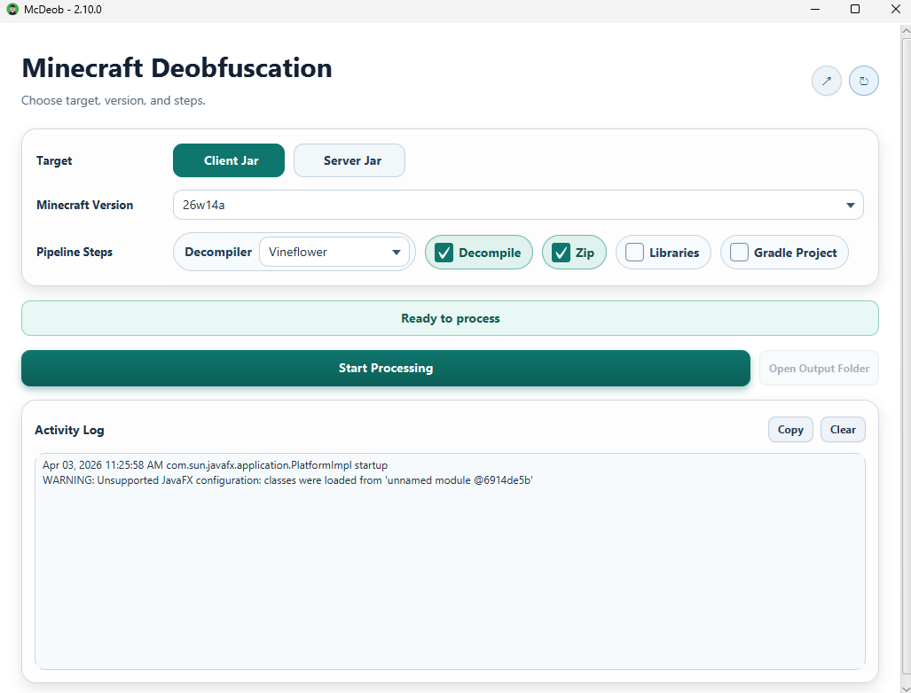

# McDeob

[](https://github.com/TimSchoenle/McDeob/releases/latest)
[](https://github.com/TimSchoenle/McDeob/blob/master/LICENSE)

McDeob is a desktop tool that helps you generate readable Minecraft client/server source output from official game
files.

## Download and Use

1. Open the latest release page:  
   [https://github.com/TimSchoenle/McDeob/releases/latest](https://github.com/TimSchoenle/McDeob/releases/latest)
2. Download the file that matches your system.
3. Run the app.
4. In the UI:
    - Choose `Client` or `Server`
    - Pick a Minecraft version
    - Enable the options you want (`Remap`, `Decompile`, `Zip`)
    - Click start and wait for completion
5. Open the output folder shown by the app.

## What You Get

- A remapped jar and/or decompiled source output
- Optional zip archive (if enabled)
- Files organized by version and selected options

## Screenshot



## Before You Start

- Internet connection is required (the app downloads Minecraft files and mappings).
- If you run a `.jar` build, install Java 21 or newer.

## Important Legal Notice

- Output is for personal use only.
- Decompiled Minecraft output contains proprietary code.
- Do not upload or redistribute generated Minecraft source files.

## Developer Section

This section is for contributors and power users who want to run McDeob from source.

### Requirements

- Java 21+
- GraalVM 21+ (`GRAALVM_HOME` set) for native builds
- Native toolchain:
  - Windows: Visual Studio Build Tools (C++ workload)
  - macOS: Xcode Command Line Tools
  - Linux: `gcc`, `g++`, and build essentials

### Run in GUI Mode

```bash
./gradlew run
```

### CLI Examples

```bash
./gradlew run --args="--versions"
./gradlew run --args="--type client --version 1.21.4 --remap --decompile --zip"
./gradlew run --args="--type client --version 1.21.4 --decompile --decompiler fernflower"
./gradlew run --args="--type client --version 1.21.4 --decompile --decompiler jadx"
./gradlew run --args="--type client --version 1.21.4 --libraries --gradle-project"
```

- `--gradle-project` requires `--decompile` and `--libraries`.
- `--decompiler` supports `vineflower` (default), `fernflower`, `cfr`, and `jadx`.

### Native Build (GluonFX)

```bash
./gradlew nativeBuild
./gradlew nativeRun
./gradlew nativePackage
```

Native artifacts are generated in `build/gluonfx/`.

### Processing Time Notes

- Remapping usually takes around 2 minutes, with visible progress.
- Decompiling usually takes around 3 minutes, and may not show fine-grained progress.
- Times vary by machine and selected options.

### Core Processing Tools

1. [Reconstruct](https://github.com/LXGaming/Reconstruct) for remapping Minecraft jars.
2. [Vineflower](https://github.com/Vineflower/vineflower) for decompilation.
3. [Fernflower profile](https://github.com/JetBrains/intellij-community/tree/master/plugins/java-decompiler/engine) for legacy-style output via Vineflower engine support.
4. [JADX](https://github.com/skylot/jadx) as an additional decompiler backend.
