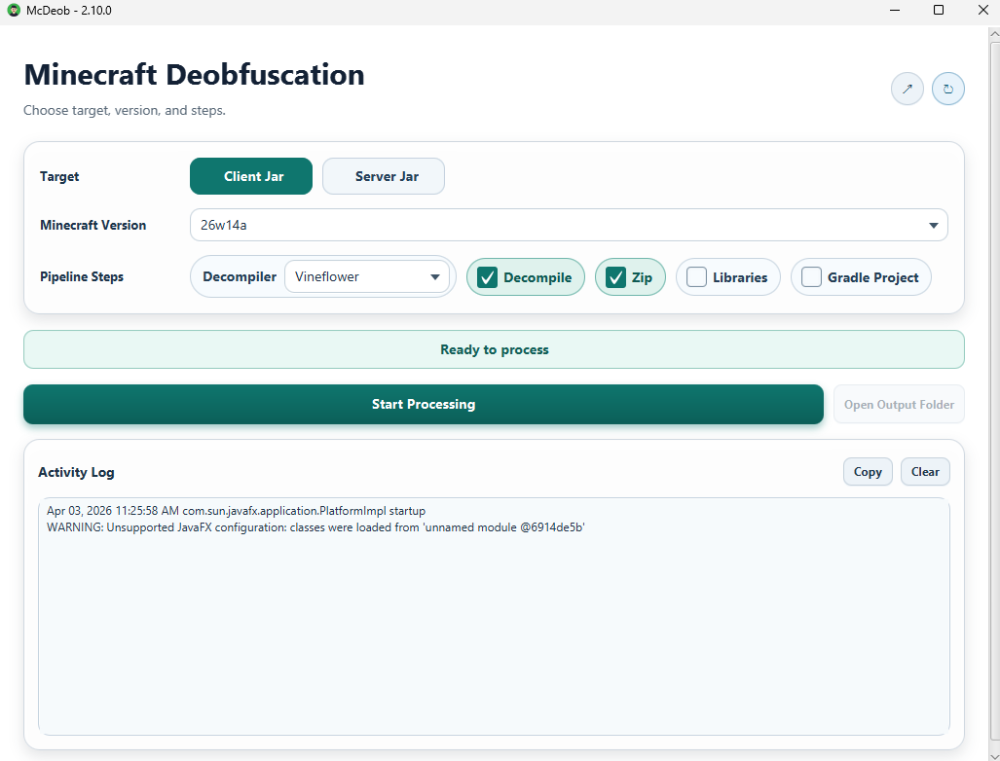

# McDeob

[](https://github.com/TimSchoenle/McDeob/releases/latest)
[](https://github.com/TimSchoenle/McDeob/blob/master/LICENSE)

McDeob is a desktop tool that helps you generate readable Minecraft client/server source output from official game
files.

## Download and Use

1. Open the latest release page:  
   [https://github.com/TimSchoenle/McDeob/releases/latest](https://github.com/TimSchoenle/McDeob/releases/latest)
2. Download the file that matches your system.
3. Run the app.
4. In the UI:
    - Choose `Client` or `Server`
    - Pick a Minecraft version
    - Pick a `Pipeline` (see below)
    - Enable the options you want (`Remap`, `Decompile`, `Zip`)
    - Click start and wait for completion
5. Open the output folder shown by the app.

## Pipelines

| Pipeline          | Targets | Output                                                                      |
|-------------------|---------|-----------------------------------------------------------------------------|
| `Mojang mappings` | Both    | Mojang's official names, applied with Reconstruct and your chosen decompiler |
| `PaperMC mache`   | Server  | Mojang's names plus named parameters and constants, in source that compiles  |

`PaperMC mache` runs [PaperMC's](https://github.com/PaperMC) own toolchain, the one Paper itself is built on:

1. [mache](https://github.com/PaperMC/mache) is downloaded for your Minecraft version. It pins the exact tool
   versions and options Paper uses, and ships the patches that make the decompiled source compilable.
2. [codebook](https://github.com/PaperMC/codebook) remaps the server jar and infers names for the parameters and
   local variables that the official mappings leave out.
3. [unpick definitions](https://github.com/PaperMC/unpick-definitions) turn magic numbers back into the named
   constants they came from.
4. The decompiler release mache pins decompiles the result, and mache's patches are applied on top.

Notes:

- Server versions only, and only versions PaperMC has published a mache build for. The option is withdrawn for
  `Client`, and the app tells you when a version has no mache build.
- The tools run in a separate Java 21 process, because mache pins a different codebook and decompiler version for
  every Minecraft version. Any installed JDK 21 or newer is used; if the machine has none, McDeob downloads an
  Eclipse Temurin runtime once into its data folder. To choose the JDK yourself, pass `--java-home` on the command
  line or set the `mcdeob.java.home` system property.
- `Remap`, `Decompile`, `Decompiler` and `Libraries` do not apply: mache always remaps and decompiles, chooses its
  own decompiler, and takes the server's libraries from Mojang's bundler jar.
- If a patch cannot be applied the run still finishes; the rejected hunks are written to
  `<version>/mache/patch-rejects` so you can see what was missed.

## What You Get

- A remapped jar and/or decompiled source output
- Optional zip archive (if enabled)
- Files organized by version and selected options
- With `PaperMC mache`, the downloaded tools and Java runtime are cached in `tool-cache` and `java-runtime` next to
  the version folders and reused by later runs

## Screenshot



## Before You Start

- Internet connection is required (the app downloads Minecraft files and mappings).
- If you run a `.jar` build, install Java 21 or newer.

## Important Legal Notice

- Output is for personal use only.
- Decompiled Minecraft output contains proprietary code.
- Do not upload or redistribute generated Minecraft source files.

## Developer Section

This section is for contributors and power users who want to run McDeob from source.

### Requirements

- Java 21+
- GraalVM 21+ (`GRAALVM_HOME` set) for native builds
- Native toolchain:
  - Windows: Visual Studio Build Tools (C++ workload)
  - macOS: Xcode Command Line Tools
  - Linux: `gcc`, `g++`, and build essentials

### Run in GUI Mode

```bash
./gradlew run
```

### CLI Examples

```bash
./gradlew run --args="--versions"
./gradlew run --args="--type client --version 1.21.4 --remap --decompile --zip"
./gradlew run --args="--type client --version 1.21.4 --decompile --decompiler fernflower"
./gradlew run --args="--type client --version 1.21.4 --decompile --decompiler jadx"
./gradlew run --args="--type client --version 1.21.4 --libraries --gradle-project"
./gradlew run --args="--type server --version 1.21.11 --pipeline mache"
./gradlew run --args="--type server --version 1.21.11 --pipeline mache --gradle-project"
./gradlew run --args="--type server --version 1.21.11 --pipeline mache --java-home /path/to/jdk-21"
```

- `--gradle-project` requires `--decompile` and `--libraries`, except with `--pipeline mache`, which always
  produces both.
- `--decompiler` supports `vineflower` (default), `fernflower`, and `jadx`.
- `--pipeline` supports `mojang` (default) and `mache`. See [Pipelines](#pipelines) for what `mache` needs and
  which options it ignores.
- The mache pipeline writes each tool's complete output to `<version>/mache/codebook.log` and
  `<version>/mache/decompiler.log`, and repeats the tail of it in the app log if a tool fails.

The generated project also declares the annotation libraries Mojang compiles against but does not
publish as runtime libraries, such as `org.jetbrains:annotations` and `com.google.code.findbugs:jsr305`.
They are detected from the decompiled imports and resolved from Maven Central, pinned to the version
that was current when the Minecraft version released. Imports that cannot be resolved are logged and
listed in the generated `README.md`.

### Native Build (GluonFX)

```bash
./gradlew nativeBuild
./gradlew nativeRun
./gradlew nativePackage
```

Native artifacts are generated in `build/gluonfx/`.

### Processing Time Notes

- Remapping usually takes around 2 minutes, with visible progress.
- Decompiling usually takes around 3 minutes, and may not show fine-grained progress.
- Times vary by machine and selected options.

### Core Processing Tools

1. [Reconstruct](https://github.com/LXGaming/Reconstruct) for remapping Minecraft jars.
2. [Vineflower](https://github.com/Vineflower/vineflower) for decompilation.
3. [Fernflower profile](https://github.com/JetBrains/intellij-community/tree/master/plugins/java-decompiler/engine) for legacy-style output via Vineflower engine support.
4. [JADX](https://github.com/skylot/jadx) as an additional decompiler backend.
